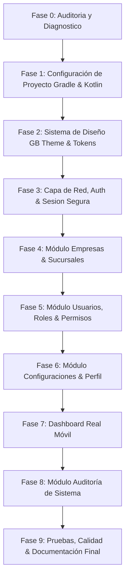

# Informe de Auditoría y Diagnóstico Técnico: Frontend Android GB ERP

**Fecha:** 2026-09-28  
**Proyecto:** GB ERP — Aplicación Android Nativa  
**Repositorio:** `https://github.com/basurto19/rp`  
**Autor:** Senior Android Engineer & Staff Software Architect  

---

## 1. Resumen Ejecutivo y Diagnóstico de Estado

Se ha llevado a cabo la auditoría técnica completa del repositorio monorepo `GB ERP` para evaluar la viabilidad, arquitectura, endpoints disponibles, requisitos de seguridad y estrategia de desarrollo de la aplicación Android nativa.

### Hallazgos Principales:
1. **Acceso al Repositorio y Monorepo**: Se confirmó el acceso total a la estructura del monorepo (`pnpm`, TypeScript, Node.js + Express en `apps/api`, React Web en `apps/web`).
2. **Estado de `apps/mobile`**: La carpeta `apps/mobile` contiene únicamente un *stub* inicial de React Native en TypeScript sin pantallas, componentes, navegación ni cliente de API. **No existe una aplicación móvil funcional**.
3. **Decisión Técnica Móvil (Fase 1)**: Dado que no hay código móvil reutilizable ni funcional en React Native, se determina la construcción de una **aplicación Android nativa moderna en Kotlin con Jetpack Compose**, garantizando máximo rendimiento, arquitectura limpia, seguridad con Android KeyStore/EncryptedSharedPreferences y una UI/UX responsive nativa de clase empresarial.
4. **Estado Real de la API Backend (`apps/api`)**: La API (`http://localhost:3000/api/v1`) está parcialmente implementada con arquitectura modular Mongoose/Express. Existen **7 módulos funcionales** con endpoints comprobados (`auth`, `users`, `companies`, `branches`, `roles`, `settings`, `audit` y `health`).
5. **Módulos Faltantes en API**: Módulos como inventario, ventas, compras, finanzas, clientes y proveedores están documentados como requisitos futuros en la API pero **no poseen controladores, rutas ni modelos en el backend actual**. En la app Android, se documentarán estos bloqueos y no se fingirán datos ni endpoints inexistentes.
6. **Identidad Visual GB ERP**: Se identificaron los activos de marca oficiales en `apps/web/public/assets/brand/apta-digital-logo.jpg` y la referencia visual de layout ERP en `docs/ui-ux/assets/erp-reference.png`. Se extrajo la paleta de color oficial directamente del logotipo: **Azul Marino Principal (`#022656`)** y **Turquesa de Acento (`#0090A0`)**.

---

## 2. Auditoría Detallada del Backend y Endpoints Disponibles

### 2.1 Módulos Implementados y Endpoints Comprobados

| Módulo | Endpoint Base | Métodos Disponibles | Permisos Requeridos | Estado |
| :--- | :--- | :--- | :--- | :--- |
| **Auth** | `/api/v1/auth` | `POST /login`<br>`POST /refresh`<br>`POST /logout`<br>`POST /logout-all`<br>`POST /forgot-password`<br>`PUT /change-password` | Público / Bearer Token | **Funcional** |
| **Users** | `/api/v1/users` | `GET /`<br>`POST /`<br>`GET /:id`<br>`PUT /:id`<br>`DELETE /:id` | `users:read`, `users:create`, `users:update`, `users:delete` | **Funcional** |
| **Companies** | `/api/v1/companies` | `GET /`<br>`POST /`<br>`GET /:id`<br>`PUT /:id`<br>`DELETE /:id` | `companies:read`, `companies:create`, `companies:update`, `companies:delete` | **Funcional** |
| **Branches** | `/api/v1/branches` | `GET /`<br>`POST /`<br>`GET /:id`<br>`PUT /:id`<br>`DELETE /:id` | `branches:read`, `branches:create`, `branches:update`, `branches:delete` | **Funcional** |
| **Roles** | `/api/v1/roles` | `GET /`<br>`POST /`<br>`GET /:id`<br>`PUT /:id`<br>`DELETE /:id` | `roles:read`, `roles:create`, `roles:update`, `roles:delete` | **Funcional** |
| **Settings** | `/api/v1/settings` | `GET /`<br>`PUT /`<br>`GET /:key`<br>`PUT /:key`<br>`DELETE /:key` | `settings:read`, `settings:update`, `settings:delete` | **Funcional** |
| **Audit** | `/api/v1/audit` | `GET /`<br>`GET /module/:module` | `audit:read` | **Funcional** |
| **Health** | `/api/v1/health` | `GET /` | Ninguno | **Funcional** |

### 2.2 Módulos Incompletos o Inexistentes en la API

Los siguientes módulos **NO están presentes en el backend** (`apps/api/src/routes/index.ts`):
- `clients` (Clientes y Contactos)
- `products` / `categories` (Catálogo de Productos)
- `inventory` / `stock` (Existencias y Movimientos)
- `sales` / `orders` / `invoices` (Ventas y Facturación)
- `purchases` / `suppliers` (Compras y Proveedores)
- `finance` / `payments` (Pagos y Cuentas por Cobrar/Pagar)
- `reports` (Generación de Reportes)
- `dashboard` (Endpoint consolidado de Métricas)

*Estrategia para Android:* La aplicación Android **NO inventará ni simulará** estos datos. Para el Dashboard, se calcularán KPIs reales consumiendo las entidades existentes (usuarios activos, empresas asociadas, sucursales y actividad de auditoría). Los módulos sin API serán marcados en el informe de arquitectura como "Pendientes de implementación en Backend".

---

## 3. Contratos de Datos, Autenticación y Manejo de Errores

### 3.1 Contrato General de Respuestas API

#### Respuesta de Éxito (`200 OK`, `201 Created`):
```json
{
  "success": true,
  "message": "Operación exitosa",
  "data": { ... },
  "pagination": {
    "total": 100,
    "page": 1,
    "limit": 20,
    "hasMore": true
  }
}
```

#### Respuesta de Error (`400`, `401`, `403`, `404`, `409`, `429`, `500`):
```json
{
  "success": false,
  "error": {
    "code": "INVALID_CREDENTIALS",
    "message": "Credenciales inválidas",
    "details": { ... }
  }
}
```

### 3.2 Mecanismo de Sesión y Autenticación
1. **Login (`POST /auth/login`)**:
   - Requiere `{ "email": "...", "password": "..." }`.
   - Devuelve `accessToken` (JWT), `refreshToken` (JWT) y objeto `user` (id, email, firstName, lastName, tenantId, branchId, roleId, permissions).
2. **Encabezados Requeridos**:
   - `Authorization: Bearer <accessToken>`
   - `x-tenant-id`: ID de la empresa/tenant en contexto.
   - `x-branch-id`: ID de la sucursal activa.
3. **Refresco de Token (`POST /auth/refresh`)**:
   - Requiere `{ "refreshToken": "..." }`.
   - Devuelve `{ "accessToken": "..." }`.
4. **Cierre de Sesión (`POST /auth/logout`)**:
   - Requiere `{ "refreshToken": "..." }` y `Authorization: Bearer <accessToken>`.

---

## 4. Identidad Visual GB ERP — Sistema de Diseño

A partir del logotipo oficial (`apps/web/public/assets/brand/apta-digital-logo.jpg`) y la referencia ERP (`docs/ui-ux/assets/erp-reference.png`), se establece la paleta de color y tokens del tema Material 3 para Jetpack Compose:

### 4.1 Palette de Colores Oficial GB ERP
- **Brand Primary Navy**: `#022656` (Azul Marino GB ERP)
- **Brand Accent Teal**: `#0090A0` (Azul Turquesa de Acento GB ERP)
- **Brand Dark Container**: `#01193B`
- **Surface Light**: `#F8FAFC` (Fondo claro limpio)
- **Surface Dark**: `#0F172A` (Fondo oscuro elegante)
- **On Primary**: `#FFFFFF`
- **Semantic Success**: `#10B981` (Verde esmeralda)
- **Semantic Warning**: `#F59E0B` (Ámbar)
- **Semantic Error**: `#EF4444` (Rojo intenso)
- **Semantic Info**: `#3B82F6` (Azul informativo)

---

## 5. Arquitectura Android Recomendada (Clean Architecture + MVVM)

### 5.1 Ubicación en el Monorepo
El proyecto Android se ubicará en `apps/mobile/android` (o de forma equivalente dentro de `apps/mobile`), estructurado como un proyecto nativo con Gradle y Kotlin, permitiendo que **Android Studio** lo abra de forma directa y reproducible sin interferir con la estructura de `pnpm` ni con el backend Node.js.

### 5.2 Stack Tecnológico Elegido
- **Lenguaje**: Kotlin 2.0+
- **UI Framework**: Jetpack Compose + Material Design 3
- **Arquitectura**: Clean Architecture por capas (Presentation, Domain, Data) con MVVM
- **Inyección de Dependencias**: Hilt (`com.google.dagger:hilt-android`)
- **Red & HTTP**: Retrofit 2 + OkHttp 4 + Kotlinx Serialization
- **Asincronía & Corrutinas**: Kotlin Coroutines (`StateFlow`, `SharedFlow`)
- **Navegación**: Navigation Compose (`androidx.navigation:navigation-compose`)
- **Seguridad**: `EncryptedSharedPreferences` / Jetpack DataStore cifrado con Android KeyStore
- **Pruebas**: JUnit 5, MockK, Coroutines Test, Compose UI Test

### 5.3 Configuración de Red para Desarrollo Local
Para probar la app Android contra la API de desarrollo local (`apps/api`):
- **Emulador Android**: `http://10.0.2.2:3000/api/v1` (10.0.2.2 redirige al `localhost` del host).
- **Dispositivo Físico**: `http://<IP_LOCAL_MAQUINA>:3000/api/v1` (por ejemplo, `http://192.168.1.50:3000/api/v1`).
- La URL base se configurará dinámicamente mediante `BuildConfig.API_BASE_URL` a través de variables en `gradle.properties` o `build.gradle.kts`.

---

## 6. Plan de Fases de Implementación Propuesto

Para garantizar entregas verificables y libres de errores, se propone el siguiente plan por fases:



### Detalle de Fases:
- **FASE 1 — Estructura y Configuración del Proyecto Nativo**:
  - Creación del proyecto Gradle en `apps/mobile/android`.
  - Configuración de Kotlin, Jetpack Compose, Material 3, Hilt, Retrofit y dependencias.
- **FASE 2 — Sistema de Diseño GB ERP (Theme, Tokens y Componentes Reutilizables)**:
  - Definición de `GBTheme`, colores (`#022656`, `#0090A0`), tipografía, formas y elevaciones.
  - Creación de componentes reutilizables: `GBButton`, `GBTextField`, `GBCard`, `GBStatusBadge`, `GBDataTable`, `GBLoadingOverlay`, `GBErrorView`, `GBTopAppBar`.
- **FASE 3 — Red, Autenticación y Gestión de Sesión Segura**:
  - Implementación de `AuthInterceptor` (Bearer Token + Tenant/Branch Headers).
  - Implementación de `TokenAuthenticator` (auto-refresh transparente ante HTTP 401).
  - Módulo de almacenamiento seguro `SecureSessionStorage` (`EncryptedSharedPreferences`).
  - `AuthRepository` y `AuthViewModel`.
  - Pantalla de Login, Recuperación de Contraseña y Selección de Sucursal/Empresa.
- **FASE 4 — Módulo de Empresas y Sucursales**:
  - DTOs, Mappers, Repositorios, ViewModels y UI para Listado, Detalle y Formularios CRUD de `Companies` y `Branches`.
- **FASE 5 — Módulo de Usuarios, Roles y RBAC**:
  - Gestión de usuarios y asignación de roles. Verificación de permisos dinámicos en la UI.
- **FASE 6 — Módulo de Configuración y Perfil de Usuario**:
  - Gestión de ajustes de tenant (`settings`) y perfil personal con cambio de contraseña.
- **FASE 7 — Dashboard ERP Real Móvil**:
  - Métricas de uso real (empresas, sucursales activas, usuarios del sistema, registros de auditoría).
  - Tarjetas KPI, accesos rápidos y gráficos/listados sintéticos.
- **FASE 8 — Módulo de Auditoría**:
  - Consulta y filtrado de logs de auditoría por módulo.
- **FASE 9 — Pruebas, Verificación y Documentación Final**:
  - Pruebas unitarias de ViewModels, Repositorios y Deserialización DTO.
  - Verificación de compilación Gradle, ejecución en emulador y creación de `docs/architecture/android-frontend.md`.

---

## 7. Declaración de Riesgos y Mitigaciones

| Riesgo | Impacto | Mitigación |
| :--- | :--- | :--- |
| **Pérdida de Sesión por Expiración de Refresh Token** | Alto | Redirección automática y segura al Login limpiando el almacenamiento cifrado. |
| **Conexión a Localhost desde Emulador/Dispositivo** | Medio | Documentación explícita de `10.0.2.2` y soporte para `BuildConfig.API_BASE_URL`. |
| **Módulos sin Endpoints en Backend** | Medio | Bloqueo documentado en informe; la UI Android informará que el módulo está en desarrollo backend sin fingir datos. |
| **Manejo de Roles/Permisos Insuficientes en UI** | Medio | Ocultar opciones sin permiso en la app, pero confiando en la validación definitiva del backend (`403 Forbidden`). |

---

## 8. Conclusión de la FASE 0

La **FASE 0 — ACCESO Y AUDITORÍA** ha sido completada satisfactoriamente. El entorno está listo y diagnosticado. 

**Esperando revisión y confirmación del usuario para proceder con la FASE 1.**
